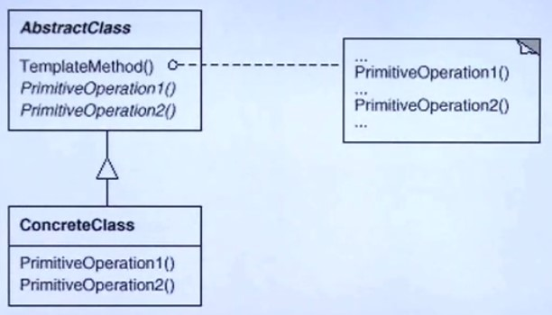

# 设计模式

## 学习设计模式目标

- 理解**松耦合**设计思想
- 掌握面向对象**设计原则**
- 掌握**重构**技法改善设计
- 掌握 GOF **核心设计模式**

## 什么是设计模式

> 每一个模式描述了一个在我们周围不断重复发生的问题以及该问题的解决方案的核心。这样，你就能一次又一次地使用该方案而不必做重复劳动。—— Christopher Alexander

## 面向对象

- 底层思维：向下，如何把握机器底层从微观理解对象构造
  - 语言构造
  - 编译转换
  - 内存模型
  - 运行时机制
- 抽象思维：向上，如何将我们的周围世界抽象为程序代码
  - 面相对象
  - 组建封装
  - 设计模式
  - 架构模式

## 深入理解面向对象

- 向下：深入理解三大面向对象机制
  - 封装：隐藏内部实现
  - 继承：复用现有代码
  - 多态：改写对象行为

- 向上：深刻把握面向对象机制所带来的抽象意义，理解如何使用把这些机制来表达现实世界，掌握什么是“好的面向对象设计”

## 软件设计固有的复杂性

建筑商从来不会去想给一栋已建好的100层高的楼房底下在新修一个小地下室——这样做化肥极大而且主要失败。然后令人惊奇的是，软件系统的用户在要求作出类似改变时却不会仔细考虑，而且他们认为这只是需要简单变成的事。—— Object-Oriented Analysis and Design with Applications(Grady Booch)

## 软件设计复杂的根本原因

**变化**

- 客户需求的变化
- 技术平台的变化
- 开发团队的变化
- 市场环境的变化

## 软件设计的目标

- 什么是好的软件设计？软件设计的金科玉律：**复用**

## 如何解决变化的复杂性

- 分解
  - 人们面对复杂性有一个常见的做法：即分而治之，将大问题分解为多个小问题，将复杂问题分解为多个简单问题。
- 抽象
  - 更高层次来讲，人们处理复杂性有一个通用的技术，即抽象。由于不能掌握全部的复杂对象，我们选择忽视它的非本质细节，而去处理泛化和理想化了的对象模型。

## 面向对象设计原则

1. 依赖倒置原则（DIP）
  + 高层模块(稳定)不应该依赖于低层模块(变化)，二者都应该依赖于抽象(稳定) 。
  + 抽象(稳定)不应该依赖于实现细节(变化) ，实现细节应该依赖于抽象(稳定)。

2. 开放封闭原则（OCP）
  + 对扩展开放，对更改封闭。
  + 类模块应该是可扩展的，但是不可修改。

3. 单一职责原则（SRP）
  + 一个类应该仅有一个引起它变化的原因。
  + 变化的方向隐含着类的责任。

4. Liskov 替换原则（LSP）
  + 子类必须能够替换它们的基类(IS-A)。
  + 继承表达类型抽象。

5. 接口隔离原则（ISP）
  + 不应该强迫客户程序依赖它们不用的方法。
  + 接口应该小而完备。

6. 优先使用对象组合，而不是类继承
  + 类继承通常为“白箱复用”，对象组合通常为“黑箱复用” 。
  + 继承在某种程度上破坏了封装性，子类父类耦合度高。
  + 而对象组合则只要求被组合的对象具有良好定义的接口，耦合度低。

7. 封装变化点
  + 使用封装来创建对象之间的分界层，让设计者可以在分界层的一侧进行修改，而不会对另一侧产生不良的影响，从而实现层次间的松耦合。

8. 针对接口编程，而不是针对实现编程
  + 不将变量类型声明为某个特定的具体类，而是声明为某个接口。
  + 客户程序无需获知对象的具体类型，只需要知道对象所具有的接口。
  + 减少系统中各部分的依赖关系，从而实现“高内聚、松耦合”的类型设计方案。

## GOF-23 模式分类

- 从目的来看
  - 创建型(Creational) 模式
  - 结构型(Structural) 模式
  - 行为型(Behavioral) 模式
- 从范围来看
  - 类模式处理类与子类的静态关系
  - 对象模式处理对象间的动态关系

## 从封装变化角度对模式分类

- 组件协作：
  - Template Method
  - Observer/Event
  - Strategy

- 单一职责：
  - Decorator
  - Bridge

- 对象创建:
  - Factory Method
  - Abstract Factory
  - Prototype
  - Builder

- 对象性能：
  - Singleton
  - Flyweight(享元模式)

- 接口隔离:
  - Façade(门面模式)
  - Proxy
  - Mediator(中介者)
  - Adapter

- 状态变化：
  - Memento(备忘录)
  - State

- 数据结构：
  - Composite(组合模式)
  - Iterator
  - Chain of Resposibility(职责链)

- 行为变化：
  - Command
  - Visitor

- 领域问题：
  - Interpreter

### 组件协作模式

> 现代软件专业分工之后的第一个结果是 **“框架与应用程序的划分“**，**”组件协作“**模式通过**晚期绑定**，来实现框架与应用程序之间的松耦合，是二者之间协作时常用的模式。

- Temlate Method
- Strategy
- Observer /Event

## 总结

- 现代较少用的模式
  - Builder
  - Mediator
  - Memento
  - Iterator
  - Chain of Resposibility
  - Command
  - Visitor
  - Interpreter

## 重构获得模式 —— Refactoring to Patterns

- 面向对象设计模式是“好的面向对象设计”所谓“好的面向对象设计” 指是那些可以满足**“应对变化，提高复用”**

- 现代软件设计的特征是**“需求的频繁变化”**。设计模式的要点是 **“寻求变化点，然后在**变化点处应用设计模式，从而更好的应对需求的变化。”** **什么时候、什么地点**应用设计模式“比”理解设计模式结构本身“ 更为重要。

- 设计模式的应用不宜先入为主，一上来就使用设计模式是对设计模式的最大误用。没有一步到位的设计模式。敏捷软件开发实践提倡“Refactoring to Patterns” 是目前普遍公认的最好的使用设计模式的方法。

## 重构关键技法

- 静态 -> 动态
- 早绑定 -> 完绑定
- 继承 -> 组合
- 编译时依赖 -> 运行时依赖
- 紧耦合 -> 松耦合

## 模板方法-Template Method

### 动机 (Motivation)

> 在软件构建过程中，对于某一项任务，他常常有**稳定**的整体的操作结构，但各个子步骤却又很多**改变**的需求，或者有固有的原因（比如框架与应用之间的关系）无法和任务的整体结构同时实现。

如何在确定**稳定操作**结构前提下，来灵活应对各个子步骤的**变化**或者**晚期实现**需求？

### 结构化软件设计流程

1 -> 2 -> 3 -> 4 -> 5

- Library 开发人员
  - 开发 1, 3, 5 三个步骤

- Application 开发人员
  - 1.开发2，4 两个步骤
  - 2.程序主流程

- Library(早) <--早绑定-- Application(晚)

### 面向对象软件设计流程

1 -> 2 -> 3 -> 4 -> 5

- Library 开发人员
  - 开发 1, 3, 5 三个步骤
  - 程序主流程

- Application 开发人员
  - 1.开发2，4 两个步骤

- Library(早) --晚绑定--> Application(晚)

### Template Method 模式定义

> 定义一个操作中的算法的骨架（稳定），而将一些步骤延迟到（变化）到子类中。Template Method 使得子类可以不改变（复用）一个算法的结构即可重定义(override 重写)该算法的某些特定步骤。

**稳定(实函数)中有变化(虚函数)**

### Template Method 结构

- 稳定部分：TemplateMethod()
- 变化部分：PrimitiveOperation1(), PrimitiveOperation2()

### Template Method 要点总结

- 用最简洁的机制（**虚函数的多调性**）为很多应用程序框架提供了灵活的**扩展点**，是代码复用方面的基本实现机构

- 除了可以灵活应对子步骤的变化外，“不要调用我，让我来调用你“的**反向控制结构**是 Template Method 的典型应用。

- 在具体实现方面，被 Template Method 调用的虚方法可以具有实现，也可以没有任何实现（抽象方法、纯虚方法），但一般推荐奖它们设置为 protected 方法。

## 策略模式 Strategy

> 又名Policy，它的用意是定义一组算法，把它们一个个封装起来，并且使他们可以相互替换。策略模式可以独立于使用他们的客户端而变化。GOF策略模式静态结构类图如下

通过上图可以看出策略模式有以下角色构成：
1. 抽象策略（Strategy）角色：抽象策略角色由抽象类或接口来承担，它给出具体策略角色需要实现的接口；
2. 具体策略（ConcreteStrategy）角色：实现封装了具体的算法或行为；
3. 场景（Context）角色：持有抽象策略类的引用。

策略模式重点是封装不同的算法和行为，不同的场景下可以相互替换。策略模式是开闭原则的体现，开闭原则讲的是一个软件实体应该对扩展开放对修改关闭。策略模式在新的策略增加时，不会影响其他类的修改，增加了扩展性，也就是对扩展是开放的；对于场景来说，只依赖于抽象，而不依赖于具体实现，所以对修改是关闭的。策略模式的认识可以借助《java与模式》一书中写到诸葛亮的锦囊妙计来学习，在不同的场景下赵云打开不同的锦囊，便化险为夷，锦囊便是抽象策略，具体的锦囊里面的计策便是具体的策略角色，场景就是赵云，变化的处境
选择具体策略的条件。

策略模式在程序设计中也很常用，在板桥（banq）的博客里有篇文章叫 “你还在用if else吗？”
“http://www.jdon.com/artichect/ifelse.htm”讲的很好，策略模式不但是继承的代替方案而且能很好地解决if else问题，下面举个实例来说明，怎么使用策略模式。

需求如下：

某支付系统接入以下几种商户进行充值：易宝网易，快线网银，19pay手机支付，支付宝支付，骏网一卡通，由于每家充值系统的结算比例不一样，而且同一家商户的不同充值方式也有所不同，具体系统情况比较复杂，像支付宝既有支付宝账号支付和支付宝网银支付等这些暂时不考虑，为了讲述策略模式这里简单描述，假如分为四种，手机支付，网银支付，商户账号支付和点卡支付。因为没个支付结算比例不同，所以对手续费低的做一些优惠活动，尽可能让用户使用手续费低的支付方式来充值，这样降低渠道费用，增加收入，具体优惠政策如下：

1. 网银充值，8.5折；
2. 商户充值，9折；
3. 手机充值，没有优惠；
4. 点卡充值，收取1%的渠道费；

[java-strategy](./java/strategy)

## 动机

在软件的构建过程中，某些对象使用的算法可能多种多样，经常改变，如果将这些算法都编码到对象中，将会使对象变的异常复杂，而且有时候支持不使用的算法也是一种负担。

如何在运行时根据需要透明地

如果在运行时根据需要透明的更改对象的算法？将算法与对象本身解耦从而避免上述问题？

strategy-opt.png

- [php-简单工厂模式](./php/simple-factory)
- [php-策略模式](./php/strategy)